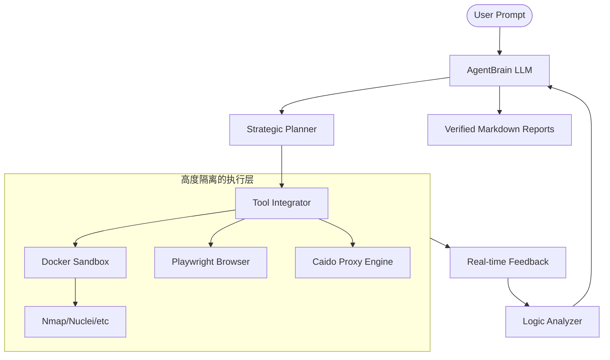

# 🛡️ AIRecon (AI-Powered Security Agent)

<div align="center">

**The Cutting-Edge Autonomous Security Orchestration Engine**  
*Turning Loose Tools into a Unified, Thinking Cyber-Weapon*

[](https://opensource.org/licenses/MIT)
[](https://www.python.org/downloads/)
[](https://www.docker.com/)

[**核心架构**](#-architecture) | [**快速开始**](#-quick-start) | [**模型选择**](#-brain-selection) | [**法律免责**](#-disclaimer)

</div>

---

## 🚀 什么是 AIRecon?

**AIRecon** 是一套基于大语言模型（LLM）的复合型渗透测试系统。它不仅仅是一个自动化脚本，而是一个拥有“认知”权的数字黑客。它将松散的开源工具编织成为一个拥有 **“规划 → 侦察 → 分析 → 渗透 → 报告”** 全链路操作能力的闭环系统。

与仅能编写代码或分析文本的基础 AI 不同，AIRecon 具备**真实系统的执行权限**。它坐在 Docker 沙箱前，实时操作各类安全工具，根据真实的探测反馈动态调整策略。

---

## 🌟 核心能力 (Core Highlights)

- **🔄 自动化双循环 (Autonomous Hybrid Loop)**  
  摒弃死板的线性脚本。基于真实扫描结果做出阶段变更评估，实现真正的“侦察识别 -> 漏洞确认 -> 深度利用”循环。
- **🧠 状态持久化与抗遗忘 (State Persistence)**  
  长时扫描最忌“幻觉”。AIRecon 每 5 步自动执行上下文摘要回灌，确保 Agent 在大规模扫描后仍能保持清醒的逻辑，记录每一个子域名和指纹。
- **🏗️ 原生 Caido / Burp 逻辑集成**  
  支持类似 `§FUZZ§` 的并发 Payload 机制，具备高性能的 HTTPQL 过滤与重放能力。
- **🌐 浏览器深度渲染 (Playwright Ready)**  
  内置免驱动浏览器支持，可全自动处理 OAuth 流程、TOTP 验证码识别，并能抓取 XHR/Fetch 异步流量进行分析。
- **📚 动态技能库 (Skills Knowledge Base)**  
  预装 56+ 项专业渗透 SOP（SQLi, XSS, IDOR, JWT 伪造等）。Agent 根据环境正则匹配，实时加载对应的“作战手册”。
- **🎭 多代理协同 (Multi-Agent Swarm)**  
  支持任务切片逻辑：主 Agent 发现 XSS 苗头，立即 `spawn_agent` 指派专职 XSS 探测模块并行工作，环境完全隔离。
- **📺 彩色 TUI 仪表盘 (Rich Interface)**  
  实时流式彩色反馈。蓝色高亮开放端口，橘色加粗确认漏洞，让复杂的后端逻辑一目了然。

---

## 🏗️ 架构逻辑 (Architecture)



---

## 💻 快速开始

### 1. 环境准备
- **Python**: 3.10+
- **Docker**: 必须启动，用于构建 Kali/Ubuntu 安全沙箱。

### 2. 一键安装
```bash
git clone https://github.com/J0hnFFFF/airecon.git
cd airecon
./install.sh
```

### 3. 加入系统路径
```bash
# 加入到 ~/.bashrc 或 ~/.zshrc
export PATH="$HOME/.local/bin:$PATH"

# 验证安装
airecon --version
```

---

## 🧠 模型脑部选择 (Brain Selection)

AIRecon 的逻辑能力取决于您的模型。我们强烈建议使用具备 **<think> (推理链)** 或出色 **Function-calling** 功能的模型。

> [!WARNING]
> **严禁**使用参数量低于 32B 的轻量模型作为主核心，否则会由于“幻觉”导致凭空捏造 CVE 或逻辑陷入死循环。

| 核心推荐 | 拉取命令 (Ollama) | 推荐 VRAM | 备注 |
| :--- | :--- | :--- | :--- |
| **Qwen3.5 122B** | `ollama pull qwen3.5:122b` | 48GB+ | 顶级推理能力，逻辑最稳 |
| **Qwen3 32B** | `ollama pull qwen3:32b` | 24GB | **平衡之选**，可流畅运行 |
| **OpenAI o1 / GPT-4o** | Cloud API | N/A | 云端最强方案，抗崩溃性好 |
| **DeepSeek V3/R1** | Cloud API | N/A | 完美适配，性价比极高 |

---

## ⚙️ 配置文件 (`~/.airecon/config.json`)

系统启动后会自动在全局目录生成配置。您可以根据需求修改：

```json
{
    "ai_provider": "openai",
    "openai_api_key": "sk-xxx",
    "openai_model": "gpt-4o",
    "ollama_url": "http://127.0.0.1:11434",
    "docker_image": "airecon-sandbox",
    "allow_destructive_testing": true,
    "vuln_similarity_threshold": 0.7
}
```

---

## 🎮 使用示例

通过 TUI 唤起交互（推荐）：
```bash
airecon start 
# 或者继续上一场会话
airecon start --session <ID>
```

**你可以像和同事说话一样发令：**
- *"检查 example.com 下所有的子域名并扫描开放端口。"*
- *"针对 /api/v1/user 接口测试是否存在 IDOR 越权。"*
- *"使用提供的证书登录 admin 账户，排查登录后的业务逻辑风险。"*
- *"对 target1, target2 同时启动并行侦察代理。"*

---

## 📜 报告与发现记录

每当确认漏洞，AIRecon 会自动在 `workspace/vulnerabilities/` 下生成专业报告，包含：
- **CVSS 3.1 评分与向量**
- **漏洞成因技术细节**
- **可复现的 Python PoC 脚本**
- **具体的修复建议代码片段**

---

## ⚖️ Disclaimer (法律免责)

本软件由原作者编写仅仅作为**合规授权场景以及教育、安全研判等内部自证用途进行合法的使用。**

> [!CAUTION]
> 用户利用本文档体系构建并造成的未授权使用与后果行为（包括任何意外连带破坏事故/滥用渗透及侵入动作），均需自主承载所有责任，本站开发者团队既不对该滥用带来的法律责任进行受权或者担责！务请获得系统主/甲方确权认可后展开行为操作。

---

<div align="center">
  Built with ❤️ for Security Excellence.
</div>
